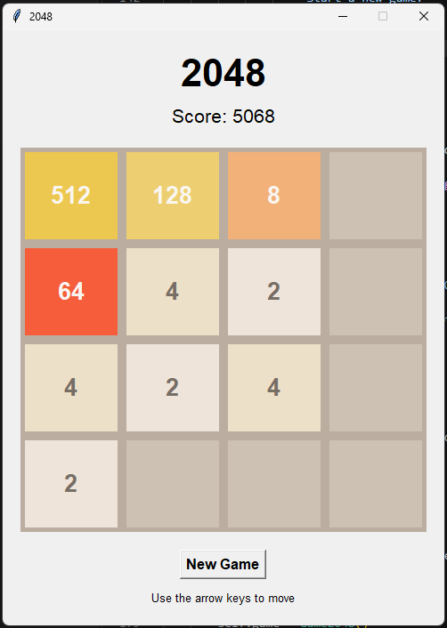

# 2048 by John Ocampo

A recreation of the classic 2048 puzzle game, developed as both a Python desktop application and a browser-based web application.

**[Play the live version](https://bugsheezy.github.io/2048-python/)**



## About the Project

This project began as a practical introduction to Python programming and game development using Tkinter.

After completing the desktop version, I expanded the project by rebuilding the game for the web using HTML, CSS, and JavaScript. The browser version introduced responsive design, mobile swipe controls, browser-based score persistence, and deployment through GitHub Pages.

The project provided hands-on experience with game logic, user interfaces, event handling, debugging, version control, responsive web development, and deployment.

## Features

- Fully playable 4×4 2048 game
- Tile movement and merging in all four directions
- Dynamic score tracking
- Persistent best score in the browser
- Random tile generation
- 90% chance of spawning a 2 and 10% chance of spawning a 4
- New tiles spawn only after a successful move
- Game-over detection
- 2048 win detection
- New Game functionality
- Colour-coded tiles
- Arrow-key and WASD controls
- Mobile swipe controls
- Responsive browser interface
- Desktop version built with Python and Tkinter
- Browser version deployed through GitHub Pages

## Technologies Used

### Desktop Application
- Python 3
- Tkinter

### Web Application
- HTML5
- CSS3
- JavaScript
- Browser Local Storage

### Development and Deployment
- Git
- GitHub
- GitHub Pages
- Visual Studio Code

## Controls

### Desktop / Browser
- Arrow keys
- WASD

### Mobile
- Swipe directly on the game board

## Project Structure

```text
2048-python/
├── docs/
│   ├── index.html
│   ├── style.css
│   └── game.js
├── screenshots/
│   └── 2048-game.png
├── game.py
├── main.py
├── high_scores.json
├── README.md
├── .gitattributes
└── .gitignore
```

## What I Learned

Building this project gave me practical experience with:

- Breaking game behaviour into smaller functions
- Implementing movement and tile-merging logic
- Managing application state and score tracking
- Building a graphical interface with Tkinter
- Manipulating HTML elements with JavaScript
- Handling keyboard and touch events
- Using browser Local Storage for persistent data
- Creating a responsive interface for desktop and mobile
- Debugging problems using browser developer tools
- Using Git and GitHub for version control
- Deploying a working web application with GitHub Pages

## Running the Project

### Play Online

The browser version is available here:

**[Launch 2048](https://bugsheezy.github.io/2048-python/)**

### Run the Python Desktop Version

Clone the repository and run:

```bash
python main.py
```

Python 3 with Tkinter is required.

## Releases

### v1.0.0 — Functional Release

The first complete release includes the desktop and browser implementations, scoring, persistent best score, keyboard controls, mobile swipe controls, responsive design, win/game-over detection, and public deployment.

### v1.1 — Planned

The next iteration will focus on subtle animations and visual polish without changing the core gameplay.

## Future Improvements

- Tile spawn animations
- Tile merge animations
- Subtle interface transitions
- Additional visual polish

## Author

**John Ocampo**

Built as a hands-on programming project exploring Python, JavaScript, interface development, debugging, version control, and web deployment.